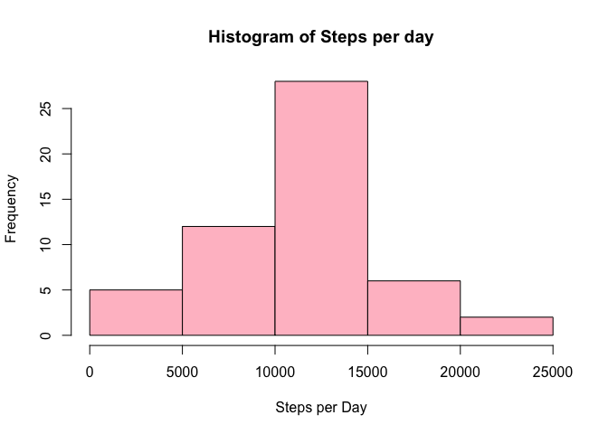
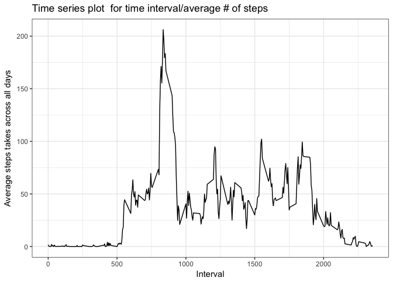
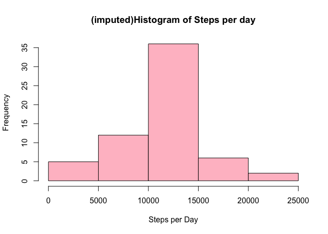
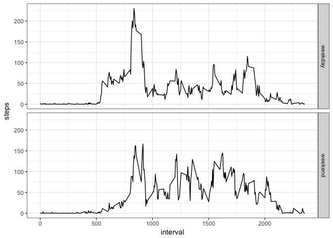

# Reproducible Research: Peer Assessment 1


##Loading and preprocessing the data

Show any code that is needed to

1.Load the data (i.e. read.csv())  
2.Process/transform the data (if necessary) into a format suitable for your analysis


```r
  #declaring library
  library(ggplot2)
  #dataset for the assignment is available here
  fileurl <-"https://d396qusza40orc.cloudfront.net/repdata%2Fdata%2Factivity.zip"
  #name of the destination file
  file_name<-"data.zip"
  #download the file from the link above
  download.file(fileurl,file_name,method = "curl")
  #extract the names of the csv file in zip file
  csv_name <- unzip(file_name,list=TRUE)$Name[1]
  # unzip the file 
  unzip(file_name)
  #read the csv file
  df_activity<- read.csv(csv_name)
```

##What is mean total number of steps taken per day?  
For this part of the assignment, you can ignore the missing values in the dataset.  
1.Calculate the total number of steps taken per day  
2.Make a histogram of the total number of steps taken each day  
3.Calculate and report the mean and median of the total number of steps taken per day 


```r
# generate df_activity_cc with complete cases only  
df_activity_cc <- na.omit(df_activity)  
#Calculate the sum of number of steps taken in a day  
steps_per_day<-aggregate(data=df_activity_cc,steps~date,sum)  
# create histogram of total number of steps in a day
hist(steps_per_day$steps,xlab="Steps per Day",main="Histogram of Steps per day",col="pink")
```

<!-- -->

```r
#mean and median of total number of steps per day
mean(steps_per_day$steps)
```

```
## [1] 10766.19
```

```r
median(steps_per_day$steps)
```

```
## [1] 10765
```
##What is the average daily activity pattern?  

1.Make a time series plot (i.e. 𝚝𝚢𝚙𝚎 = "𝚕") of the 5-minute interval (x-axis) and the average number of steps taken, averaged across all days (y-axis)  
2.Which 5-minute interval, on average across all the days in the dataset, contains the maximum number of steps?


```r
#mean steps per day across all days
mean_steps_interval<-aggregate(data=df_activity,steps~interval,mean)


ggplot(mean_steps_interval,aes(interval,steps))+geom_line()+theme_bw() + xlab("Interval")+ylab("Average steps takes across all days") + ggtitle("Time series plot  for time interval/average # of steps")
```

<!-- -->

```r
#maximum number of average steps in 5 minutes interval
mean_steps_interval[which.max(mean_steps_interval$steps),]
```

```
##     interval    steps
## 104      835 206.1698
```
##Imputing missing values

Note that there are a number of days/intervals where there are missing values (coded as 𝙽𝙰). The presence of missing days may introduce bias into some calculations or summaries of the data.  

1.Calculate and report the total number of missing values in the dataset (i.e. the total number of rows with 𝙽𝙰s)
2.Devise a strategy for filling in all of the missing values in the dataset. The strategy does not need to be sophisticated. For example, you could use the mean/median for that day, or the mean for that 5-minute interval, etc.  
3.Create a new dataset that is equal to the original dataset but with the missing data filled in.  
4.Make a histogram of the total number of steps taken each day and Calculate and report the mean and median total number of steps taken per day. Do these values differ from the estimates from the first part of the assignment? What is the impact of imputing missing data on the estimates of the total daily number of steps?


```r
# total number of missing values in the dataset
nrow(df_activity[is.na(df_activity$steps),])
```

```
## [1] 2304
```

```r
#perform imputation
for(i in 1:nrow(df_activity)){
  if(is.na(df_activity$steps[i])){
     interval<-df_activity$interval[i]
     row_no <- which(mean_steps_interval$interval==interval)
     df_activity$steps[i] <- mean_steps_interval$steps[row_no]
  }}
#total number if steps taken each day
total_steps_per_day_imputed<-aggregate(data=df_activity,steps~date,sum) 

hist(total_steps_per_day_imputed$steps,xlab="Steps per Day",main="(imputed)Histogram of Steps per day",col="pink")
```

<!-- -->

```r
#mean and median of total number of steps per day after imputing values
mean(total_steps_per_day_imputed$steps)
```

```
## [1] 10766.19
```

```r
median(total_steps_per_day_imputed$steps)
```

```
## [1] 10766.19
```

```r
#mean and median of total number of steps per day
mean(steps_per_day$steps)
```

```
## [1] 10766.19
```

```r
median(steps_per_day$steps)
```

```
## [1] 10765
```
##Are there differences in activity patterns between weekdays and weekends?

For this part the 𝚠𝚎𝚎𝚔𝚍𝚊𝚢𝚜() function may be of some help here. Use the dataset with the filled-in missing values for this part.  
 
1.Create a new factor variable in the dataset with two levels – “weekday” and “weekend” indicating whether a given date is a weekday or weekend day.  
2.Make a panel plot containing a time series plot (i.e. 𝚝𝚢𝚙𝚎 = "𝚕") of the 5-minute interval (x-axis) and the average number of steps taken, averaged across all weekday days or weekend days (y-axis). See the README file in the GitHub repository to see an example of what this plot should look like using simulated data.  

```r
#identify the day for the date
df_activity$day<-weekdays(as.Date(df_activity$date,"%Y-%m-%d"))

for(i in 1:nrow(df_activity))
{
  if(df_activity$day[i] == "Saturday"|| df_activity$day[i]=="Sunday"){
    df_activity$day_type[i]<-"weekend"
  }
  else
    df_activity$day_type[i]<-"weekday"

}
mean_steps_interval_imputed<-aggregate(data=df_activity,steps~interval+day_type,mean)

ggplot(mean_steps_interval_imputed,aes(interval,steps))+geom_line()+theme_bw() + facet_grid(day_type~.)
```

<!-- -->
